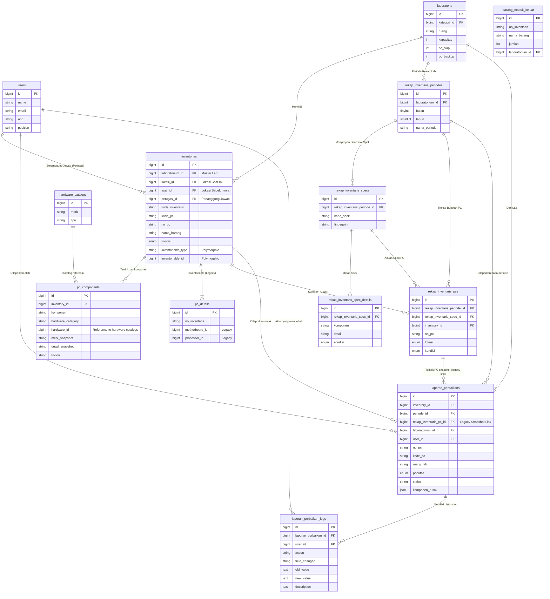

# Audit Struktur Database & ERD Project SIOPAL (Modul Inventaris Laboratorium)

Berikut adalah hasil audit struktur database untuk modul inventaris laboratorium berdasarkan *source code* (migrations & models) saat ini.

## 1. Entity-Relationship Diagram (ERD)

## 2. Kategori & Penjelasan Tabel

### A. Tabel Master / Current Data (Data Aktif)
1. **`users`**: Menyimpan data Super Admin, Laboran, Dosen, dll. Menjadi acuan login dan tracking (actor).
2. **`laboratoria`**: Data master ruang lab beserta kapasitas dan statistik dasar.
3. **`inventories`**: **Tabel Utama/Master** untuk semua barang (PC, Non-PC, Software). Memiliki kolom tracking fisik mutasi (`lokasi_id` saat ini, `asal_id` sebelumnya) dan penanggung jawab (`petugas_id`).
4. **`pc_components`**: Menyimpan detail perangkat keras (komponen) *aktual/saat ini* yang terpasang pada suatu PC di `inventories`. Ini menggantikan relasi kaku (hardcoded) yang ada di `pc_details`.
5. **Katalog Hardware** (`motherboards`, `processors`, dll): Data referensi baku dari merk dan tipe hardware.

### B. Tabel Snapshot / Histori (Rekap Bulanan)
Tabel-tabel ini berfungsi untuk membekukan (*freeze*) data setiap bulan untuk keperluan pelaporan, sehingga jika master PC di-*update* bulan depan, rekap bulan lalu tidak berubah.
1. **`rekap_inventaris_periodes`**: Data periode bulan dan tahun per laboratorium (contoh: Januari 2026 - Lab Komputer A).
2. **`rekap_inventaris_specs`**: Snapshot unik dari spesifikasi yang ada di lab tersebut pada bulan tersebut (contoh: Spek D2B/2026A).
3. **`rekap_inventaris_spec_details`**: Isi komponen dari snapshot spek (processor apa, RAM berapa).
4. **`rekap_inventaris_pcs`**: Daftar PC yang difoto/di-snapshot pada bulan tersebut, tertaut dengan spesifikasi yang mana.

### C. Tabel Transaksi / Laporan
1. **`laporan_perbaikans`**: Tabel utama untuk request perbaikan. Sudah di-*enhance* agar tersambung ke `inventory_id` (master data) dan `periode_id` (bulan pelaporan).
2. **`laporan_perbaikan_logs`**: *Audit trail* khusus untuk mencatat pergerakan status, prioritas, dan perubahan komponen dari `laporan_perbaikans`.
3. **`activity_logs` / `activity_log`**: Log aktivitas umum sistem (Create, Update, Delete, Login).

### D. Tabel Legacy / Backward Compatibility
1. **`pc_details`**: Awalnya digunakan untuk menyimpan relasi foreign key dari tiap-tiap hardware (motherboard, vga, dll) secara *hardcoded* untuk sebuah PC. Ini dipertahankan agar konsep *Polymorphic* (`inventoriable`) di `inventories` tetap berjalan, namun peran datanya sudah mulai digantikan oleh `pc_components`.
2. **`lapor_ptpps`**: Laporan versi lama (Permintaan Tindakan Perbaikan dan Pencegahan) yang strukturnya lebih mirip dokumen kertas statis.

### E. Tabel Future Feature (Belum Terintegrasi Penuh)
1. **`barang_masuk`** & **`barang_keluar`**: Tabel untuk fitur *Inventory Control/Warehouse* (stok masuk/keluar) yang saat ini belum terhubung langsung ke mutasi `inventories` secara sistematis.

---

## 3. Relasi & Keterhubungan Kunci (Foreign Key)

*   **Polymorphic Inventories:** `inventories` menggunakan `inventoriable_id` & `inventoriable_type` untuk terhubung ke `pc_details`, `non_pc_details`, atau `software_details`.
*   **Tracking Lokasi:** `inventories` mempunyai `laboratorium_id` (Master Lab), `lokasi_id` (Lokasi Fisik Terkini), dan `asal_id` (Lokasi Sebelumnya) yang semuanya berelasi ke tabel `laboratoria`. Hal ini memfasilitasi pelacakan pindah barang.
*   **Komponen PC:** `pc_components` menghubungkan master PC (`inventory_id`) ke berbagai katalog hardware (`hardware_id` + `hardware_category`).
*   **Laporan Perbaikan:** Laporan ini adalah *Hybrid*. Ia mengacu ke `inventory_id` (Master data, supaya bisa update status komponen saat diperbaiki) dan ke `periode_id` (sebagai penanda di bulan apa dilaporkan).

---

## 4. Alur Data (Data Flow)

### A. Alur Inventaris PC
1. User menginput PC baru. Data masuk ke `pc_details` untuk mendapatkan ID Polymorphic.
2. Data utama, penomoran (`kode_pc`, `no_pc`), dan alokasi lab tersimpan di `inventories`.
3. Model `Inventory` akan melakukan *sync* hardware ke dalam tabel `pc_components` untuk mencatat komponen aktual yang terpasang.

### B. Alur Rekap Bulanan
1. Di awal/akhir bulan, sistem di-generate/mem-buat `rekap_inventaris_periodes`.
2. Sistem mengecek semua `inventories` (PC) di Lab tersebut.
3. Mengelompokkan PC berdasarkan spesifikasi (`pc_components`) lalu menyimpannya ke `rekap_inventaris_specs` & `rekap_inventaris_spec_details`.
4. Menyalin data PC ke `rekap_inventaris_pcs` sebagai rekaman riwayat bulan tersebut yang tidak akan berubah meski master PC dibongkar.

### C. Alur Laporan Pengajuan
1. Laboran mengajukan laporan. Data di-insert ke `laporan_perbaikans` menunjuk ke master `inventory_id` dan periode pelaporan saat ini.
2. Ketika diajukan, `laporan_perbaikan_logs` otomatis mencatat aksi "create".

### D. Alur Log Aktivitas (Audit Trail)
1. Setiap kali Super Admin / Teknisi mengubah status (misal dari "Pending" menjadi "Diproses" atau prioritas "Rendah" ke "Tinggi") di form Filament, observer mendeteksi perubahan (`isDirty`).
2. Log tertulis di `laporan_perbaikan_logs` mencatat nilai lama (`old_value`) dan baru (`new_value`) beserta aktornya (`user_id`).
3. Aktivitas umum CRUD tercatat juga di paket eksternal Spatie `activity_logs`.

---

## 5. Rekomendasi Struktur Final (Paling Aman)

Untuk menjaga integritas dan menghindari redundansi di masa depan:
1. **Jadikan `inventories` sebagai Single Source of Truth:** Semua transaksi (Laporan, Pindah Lab) wajib mengacu pada `inventory_id`.
2. **Gunakan `pc_components` sebagai master spek aktif:** Hindari membaca hardware langsung dari relasi kaku di `pc_details`.
3. **Putuskan (Decouple) Laporan Perbaikan dari Snapshot Bulanan:** `laporan_perbaikans` sebaiknya *tidak* bergantung langsung pada `rekap_inventaris_pc_id`, melainkan cukup ke `inventory_id` dan `periode_id`. Karena jika laporan ditambahkan di luar masa rekap, ID rekap_pc bisa bermasalah. (Hal ini sepertinya sudah mulai Anda terapkan di migrasi terbaru).

---

## 6. Catatan Redundansi (JANGAN DIHAPUS DULU)

Ada beberapa struktur yang redundan karena masa transisi pengembangan, **biarkan saja dulu demi *backward compatibility***:
1. **Foreign Key Hardware di `pc_details`**: Kolom seperti `motherboard_id`, `processor_id` di tabel `pc_details` sangat redundant dengan `pc_components`. *Jangan dihapus*, karena form input Filament mungkin masih nge-bind (mengikat) datanya ke relasi ini sebelum di-sync ke `pc_components`.
2. **`rekap_inventaris_pc_id` di `laporan_perbaikans`**: Tabel laporan perbaikan sekarang punya `inventory_id` dan `rekap_inventaris_pc_id`. Konsep barunya menggunakan `inventory_id`. `rekap_inventaris_pc_id` redundan tapi berpotensi memecah data lama jika di-drop.
3. **Kolom string `komponen` & `kondisi` di `laporan_perbaikans`**: Sudah ada kolom JSON `komponen_rusak`, tapi dua kolom ini baru ditambahkan. Berguna untuk laporan simpel.

---

## 7. Prioritas Pengembangan Berikutnya

1. **Sinkronisasi Mutasi (Pindah Lab):** Memastikan ketika `lokasi_id` di `inventories` diupdate, ada form/log mutasi perpindahan fisik alat, karena saat ini hanya terganti angkanya tanpa *history* (kecuali terekam di spatie activity log).
2. **Integrasi Gudang (Barang Masuk/Keluar):** Menyambungkan fitur `barang_masuk` dan `barang_keluar` dengan master `inventories` agar ada sistem *Stock Keeping Unit* (SKU) yang valid.
3. **Penyelarasan Form Filament:** Mengubah UI Form Filament agar membaca daftar hardware (RAM, Proc, dll) langsung dari `pc_components` bukan lagi mem-*bypass* ke `pc_details`.
4. **Finalisasi Laporan Perbaikan Logs UI:** Memastikan *Timeline* riwayat dari `laporan_perbaikan_logs` tampil sempurna dan human-readable di halaman ViewRecord Laporan Pengajuan.
