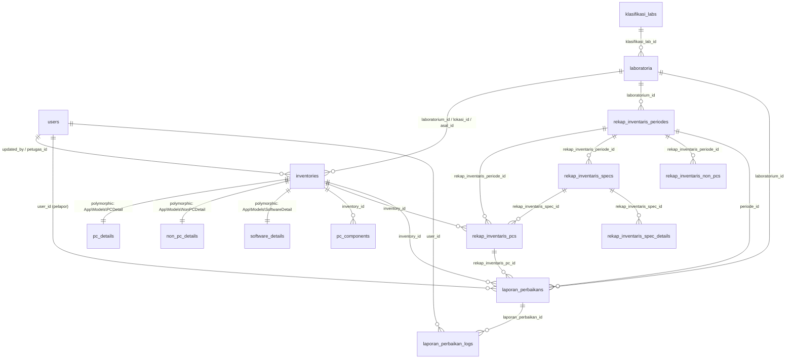
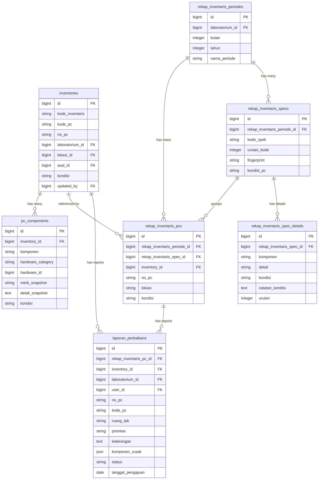
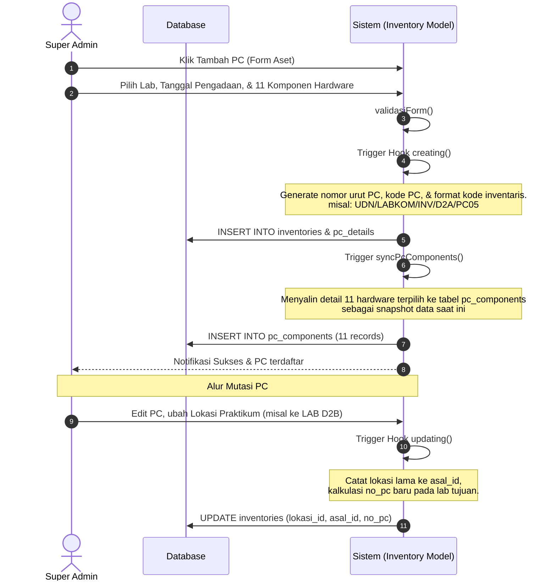
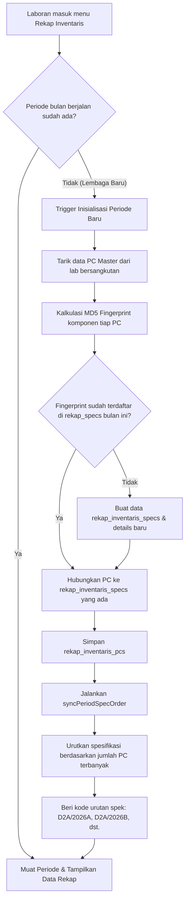
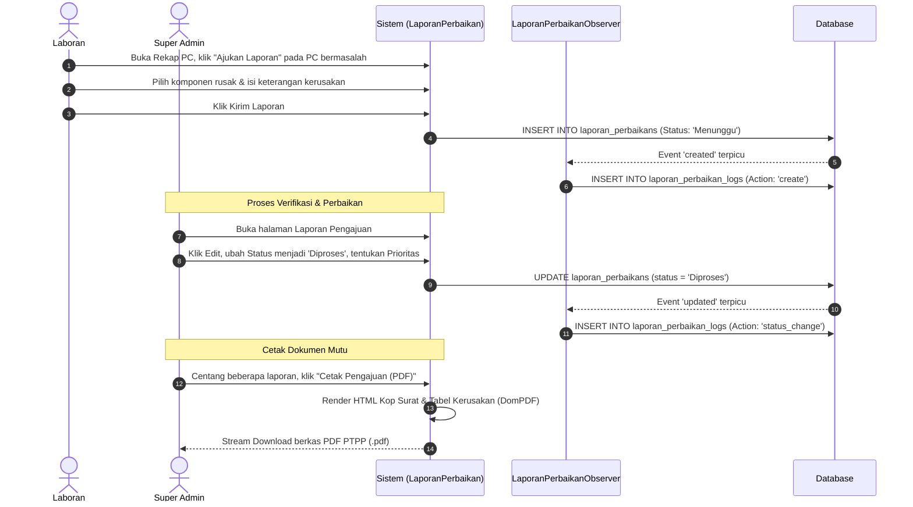

# Analisis dan Audit Fitur Utama SIOPAL (Sistem Informasi Operasional dan Inventaris Laboratorium)

Dokumen ini disusun sebagai dokumentasi teknis komprehensif untuk mendeskripsikan arsitektur sistem, struktur database, pemetaan file, alur proses, dan analisis risiko pada proyek SIOPAL. Dokumen ini dapat digunakan sebagai referensi utama penulisan laporan Kerja Praktek (KP) khususnya pada Bab 3 (Analisis dan Perancangan) serta Bab 4 (Implementasi dan Pengujian).

---

## Executive Summary

SIOPAL adalah sistem berbasis web yang dirancang khusus untuk mengotomatisasi pencatatan inventaris, pelaporan kerusakan, penjadwalan, dan rekapitulasi kondisi perangkat keras (PC dan Non-PC) serta perangkat lunak (Software) di lingkungan Laboratorium Komputer. Sistem ini dikembangkan menggunakan framework **Laravel** dengan panel administratif berbasis **Filament v3**.

### Karakteristik Utama Sistem:
*   **Role-Based Access Control (RBAC):** Pembagian hak akses yang ketat antara **Super Admin** (memiliki kendali penuh terhadap seluruh laboratorium, konfigurasi master data, perizinan, dan persetujuan perbaikan) dan **Laboran** (hanya berwenang mengelola data, melakukan rekapitulasi bulanan, dan melaporkan kerusakan pada laboratorium tempat mereka ditugaskan).
*   **Polymorphic Inventory System:** Penyimpanan data inventaris menggunakan relasi polimorfik (`inventoriable`) yang membagi barang menjadi tiga kategori detail: `PCDetail`, `NonPCDetail`, dan `SoftwareDetail` di bawah satu tabel induk `inventories`.
*   **Monthly Snapshot (Rekapitulasi Kondisi):** Fitur unik rekapitulasi bulanan yang menangkap keadaan (*snapshot*) spesifikasi komputer secara dinamis dan mengelompokkan PC dengan spesifikasi identik ke dalam kode spesifikasi yang teratur menggunakan algoritma sidik jari (*fingerprinting*).
*   **Audit Trail & Logs:** Pencatatan otomatis aktivitas operasional (log pembuatan/perubahan inventaris) menggunakan paket `spatie/laravel-activitylog` serta log manual/terarah untuk penanganan perubahan laporan perbaikan lewat `laporan_perbaikan_logs`.

---

## Modul dan Fitur

Berikut adalah analisis detail untuk masing-masing modul operasional SIOPAL:

### 1. Inventaris PC
*   **Tujuan Fitur:** Mengelola data inventaris unit komputer (PC) secara terpusat pada setiap laboratorium, mencakup identifikasi fisik, riwayat penempatan, kondisi umum, dan spesifikasi detail hardware yang terpasang.
*   **Role yang Mengakses:** Super Admin & Laboran.
*   **Hak Akses Tiap Role:**
    *   **Super Admin:** *Create, Read, Update, Delete, Export Excel, View Detail Components*.
    *   **Laboran:** *Read, Update* (terbatas hanya untuk PC di laboratorium wewenangnya), *View Detail Components*. Laboran tidak dapat membuat (`Create`) atau menghapus (`Delete`) unit PC master.
*   **Tabel Database:** 
    *   `inventories` (Induk data polimorfik)
    *   `pc_details` (Detail teknis relasi komponen)
    *   `pc_components` (Snapshot teks/snapshot merk komponen terpasang)
*   **Relasi Tabel:**
    *   `inventories.inventoriable_id` & `inventories.inventoriable_type` $\rightarrow$ Relasi polimorfik ke `pc_details.id`
    *   `inventories.laboratorium_id` $\rightarrow$ Relasi ke `laboratoria.id` (Lab kepemilikan)
    *   `inventories.lokasi_id` $\rightarrow$ Relasi ke `laboratoria.id` (Lokasi fisik saat ini, termasuk opsi "Gudang")
    *   `inventories.asal_id` $\rightarrow$ Relasi ke `laboratoria.id` (Asal laboratorium jika PC dimutasi, atau NULL jika pengadaan baru)
    *   `inventories.updated_by` $\rightarrow$ Relasi ke `users.id` (User terakhir yang mengubah data)
    *   `pc_components.inventory_id` $\rightarrow$ Relasi ke `inventories.id`
    *   `pc_details` $\rightarrow$ Relasi asing (`belongsTo`) ke 11 tabel master hardware (`processors`, `motherboards`, dsb.)
*   **Model Laravel:** `App\Models\Inventory`, `App\Models\PCDetail`, `App\Models\PcComponent`
*   **Filament Resource/Page:** `App\Filament\Resources\PCInventoryResource`
*   **File Penting:**
    *   `app/Models/Inventory.php` (Mengatur generator otomatis `kode_inventaris`, `kode_pc`, `no_pc` saat pembuatan, dan mutasi asal/lokasi saat perubahan)
    *   `app/Filament/Resources/PCInventoryResource.php` (Mengatur form skema komponen, filter data per-lab wewenang, dan modal detail komponen)
    *   `resources/views/filament/components/pc-detail-modal.blade.php` (Tampilan modal untuk list komponen PC)
*   **Alur Proses Fitur:**
    1.  Super Admin mendaftarkan PC baru pada laboratorium tertentu.
    2.  Sistem secara otomatis men-generate `kode_inventaris` (Format: `UDN/LABKOM/INV/[LAB]/PC[XX]`), `kode_pc` (4 digit urut global, misal `0025`), dan `no_pc` (Format: `[KODELAB]/[XX]`, misal `D2A/001`).
    3.  Ketika form disimpan, sistem memetakan ID komponen hardware dari model `PCDetail` dan menyalin snapshot nama serta merk komponen tersebut ke tabel `pc_components` melalui metode `syncPcComponents()`.
    4.  Laboran dapat memantau daftar PC laboratoriumnya, melihat spesifikasi detail melalui modal popup, dan memperbarui kondisi umum PC jika terjadi kerusakan.
*   **Kategori Fitur:** Master Data & Transaksi (Mutasi lokasi).
*   **Risiko & Evaluasi:** 
    *   Penghapusan PC harus secara berjenjang menghapus `pc_details` terkait (sudah ditangani via event hook `before` delete di Resource).
    *   Mutasi PC ke lokasi "Gudang" memindahkan `lokasi_id` ke ID Gudang tetapi mempertahankan `laboratorium_id` agar pencatatan aset asal tidak hilang.

---

### 2. Rekap Inventaris
*   **Tujuan Fitur:** Menyediakan lembar kerja bulanan (*monthly snapshot*) bagi laboran untuk mengaudit kondisi ruangan fisik, mendata kondisi setiap PC (beserta 9 komponen hardware utamanya), serta mengelompokkan PC dengan spesifikasi identik untuk mempermudah pemetaan laboratorium.
*   **Role yang Mengakses:** Super Admin & Laboran.
*   **Hak Akses Tiap Role:**
    *   **Super Admin:** *Read* (Monitoring semua lab), *Create* (Buat periode baru), *Copy* data dari bulan sebelumnya, *Download PDF/Excel/CSV*.
    *   **Laboran:** *Read* (Lab sendiri), *Update* (Mengubah kondisi PC & detail komponen pada periode berjalan), *Tarik Data Master* (Mengisi ulang rekap dari kondisi master terkini), *Ajukan Laporan per PC/Bulk*.
*   **Tabel Database:** 
    *   `rekap_inventaris_periodes` (Data bulan, tahun, dan laboratorium)
    *   `rekap_inventaris_pcs` (Daftar PC dalam rekapitulasi)
    *   `rekap_inventaris_specs` (Daftar spesifikasi unik hasil pengelompokan fingerprint)
    *   `rekap_inventaris_spec_details` (Detail komponen dan kondisi spesifikasi)
    *   `rekap_inventaris_non_pcs` (Daftar inventaris non-komputer dalam rekapitulasi)
*   **Relasi Tabel:**
    *   `rekap_inventaris_periodes.laboratorium_id` $\rightarrow$ `laboratoria.id`
    *   `rekap_inventaris_pcs.rekap_inventaris_periode_id` $\rightarrow$ `rekap_inventaris_periodes.id`
    *   `rekap_inventaris_pcs.rekap_inventaris_spec_id` $\rightarrow$ `rekap_inventaris_specs.id`
    *   `rekap_inventaris_pcs.inventory_id` $\rightarrow$ `inventories.id`
    *   `rekap_inventaris_specs.rekap_inventaris_periode_id` $\rightarrow$ `rekap_inventaris_periodes.id`
    *   `rekap_inventaris_spec_details.rekap_inventaris_spec_id` $\rightarrow$ `rekap_inventaris_specs.id`
    *   `rekap_inventaris_non_pcs.rekap_inventaris_periode_id` $\rightarrow$ `rekap_inventaris_periodes.id`
*   **Model Laravel:** `RekapInventarisPeriode`, `RekapInventarisPc`, `RekapInventarisSpec`, `RekapInventarisSpecDetail`, `RekapInventarisNonPc`
*   **Filament Resource/Page:** `App\Filament\Pages\RekapInventaris` (Custom Page)
*   **File Penting:**
    *   `app/Filament/Pages/RekapInventaris.php` (Logika inisialisasi, pemfilteran wewenang laboran, download PDF/Excel/CSV, action salin periode/tarik data master)
    *   `app/Livewire/RekapInventaris/PcTable.php` (Tabel interaktif Livewire untuk input kondisi komponen PC dan tombol pelaporan kerusakan)
    *   `app/Livewire/RekapInventaris/NonPcTable.php` (Tabel interaktif Livewire untuk input kondisi barang non-PC)
    *   `app/Services/RekapInventarisSpecService.php` (Service penanganan *fingerprinting* spesifikasi komputer, pengelompokan otomatis PC ke dalam `kode_spek` seperti `D2A/2026A`, `D2A/2026B`, dan pengurutan dinamis berdasarkan jumlah terbanyak)
*   **Alur Proses Fitur:**
    1.  Sistem mendeteksi apakah periode bulan berjalan sudah ada. Jika laboran membuka halaman, sistem otomatis membuat periode baru (atau Super Admin membuatnya secara manual).
    2.  Saat periode baru dibuat, sistem menyalin data dari Inventaris PC master (`inventories` & `pc_components`) ke rekap melalui `autoPopulateFromMaster()`.
    3.  Setiap PC dianalisis komponennya (CPU, RAM, Motherboard, VGA, dsb.). Data tersebut di-hash menggunakan MD5 untuk menghasilkan sidik jari (*fingerprint*).
    4.  PC dengan fingerprint yang identik akan dikelompokkan ke dalam satu baris `rekap_inventaris_specs` dengan kode spek berurutan (misal `D2A/2026A`, `D2A/2026B` dst.).
    5.  Laboran memeriksa fisik lab dan memperbarui kondisi komponen lewat form inline. Jika kondisi diubah menjadi bermasalah (misal RAM diubah dari 'Baik' menjadi 'Rusak'), sistem otomatis menghitung ulang fingerprint PC tersebut, memindahkannya ke kelompok spesifikasi yang sesuai (atau membuat kelompok spek baru), dan mengurutkan ulang kode spesifikasi lab.
    6.  Laboran mengklik "Ajukan Laporan" untuk meneruskan temuan kerusakan ke modul perbaikan.
*   **Kategori Fitur:** Transaksi & Histori/Snapshot (Menyimpan riwayat kondisi lab bulan demi bulan secara terpisah).
*   **Risiko & Evaluasi:**
    *   *Data Redundancy:* Data spesifikasi diduplikasi per bulan untuk menjaga histori historis agar kondisi lab di masa lalu tidak berubah meskipun inventaris master di-update. Ini merupakan keputusan desain yang benar untuk audit log tahunan.

---

### 3. Laporan Perbaikan / Pengajuan
*   **Tujuan Fitur:** Memfasilitasi pelaporan kerusakan komponen PC yang teridentifikasi selama masa rekapitulasi, memantau proses perbaikan perangkat, serta menyediakan sarana cetak dokumen PTPP (Permintaan Tindakan Perbaikan dan Pencegahan) resmi.
*   **Role yang Mengakses:** Super Admin & Laboran.
*   **Hak Akses Tiap Role:**
    *   **Super Admin:** *Read* (Semua laporan), *Update* (Hanya Super Admin yang berhak mengubah `status` perbaikan, `prioritas`, dan mengisi `keterangan` tindakan), *Delete*, *Export PDF (PTPP)*, *Export Excel*.
    *   **Laboran:** *Create* (Mengajukan melalui halaman Rekapitulasi secara individual atau bulk), *Read* (Melihat daftar laporan labnya), *Export PDF (Single)*. Laboran dilarang mengedit status perbaikan secara langsung.
*   **Tabel Database:** 
    *   `laporan_perbaikans` (Menyimpan data laporan kerusakan)
    *   `laporan_perbaikan_logs` (Menyimpan riwayat aktivitas perubahan status/detail)
*   **Relasi Tabel:**
    *   `laporan_perbaikans.rekap_inventaris_pc_id` $\rightarrow$ `rekap_inventaris_pcs.id` (Relasi opsional ke data snapshot rekap)
    *   `laporan_perbaikans.inventory_id` $\rightarrow$ `inventories.id` (Relasi langsung ke PC master)
    *   `laporan_perbaikans.periode_id` $\rightarrow$ `rekap_inventaris_periodes.id`
    *   `laporan_perbaikans.laboratorium_id` $\rightarrow$ `laboratoria.id`
    *   `laporan_perbaikans.user_id` $\rightarrow$ `users.id` (Identitas laboran pelapor)
    *   `laporan_perbaikan_logs.laporan_perbaikan_id` $\rightarrow$ `laporan_perbaikans.id`
    *   `laporan_perbaikan_logs.user_id` $\rightarrow$ `users.id` (User yang melakukan tindakan)
*   **Model Laravel:** `LaporanPerbaikan`, `LaporanPerbaikanLog`
*   **Filament Resource/Page:** `App\Filament\Resources\LaporanPerbaikanResource`
*   **File Penting:**
    *   `app/Filament/Resources/LaporanPerbaikanResource.php` (Mengatur pembatasan form read-only untuk laboran, export PDF massal dengan template kop surat Udinus, dan cetak PDF satuan)
    *   `app/Observers/LaporanPerbaikanObserver.php` (Secara otomatis menangkap pembuatan dan perubahan status/prioritas laporan lalu mencatatnya ke `laporan_perbaikan_logs`)
    *   `resources/views/pdf/laporan-pengajuan.blade.php` (Template blade HTML-to-PDF dokumen PTPP massal menggunakan DomPDF)
    *   `resources/views/pdf/laporan-pengajuan-tunggal.blade.php` (Template PDF untuk satu pengajuan)
*   **Alur Proses Fitur:**
    1.  Laboran mendapati komponen PC bermasalah di tabel Rekap, memilih tombol "Ajukan Laporan" (atau mencentang banyak baris PC dan menggunakan bulk action "Laporkan Perbaikan").
    2.  Data laporan terisi: `no_pc`, `kode_pc`, `laboratorium_id`, nama komponen, kondisi, dan kolom `komponen_rusak` (disimpan dalam format JSON). Status default diset ke `'Menunggu'`.
    3.  Saat tersimpan, `LaporanPerbaikanObserver` mencatat log awal `'create'` pada tabel `laporan_perbaikan_logs`.
    4.  Super Admin menerima notifikasi/melihat daftar laporan, mengubah prioritas (Rendah/Sedang/Tinggi) dan memperbarui status menjadi `'Diproses'` saat perbaikan berjalan.
    5.  Setelah selesai diperbaiki (diganti atau dibenahi), Super Admin menyetel status ke `'Selesai'`. Setiap perubahan terekam otomatis pada log audit trail laporan.
    6.  Super Admin dapat mengekspor dokumen PTPP berformat PDF sesuai standar dokumen mutu universitas (`F.LAB.KOM-UDINUS-SH-03-02`).
*   **Kategori Fitur:** Transaksi & Audit Log.
*   **Risiko & Evaluasi:**
    *   Perlu dipastikan integritas data ketika record inventaris master (`inventories`) dihapus. Karenanya, relasi diset `nullOnDelete` pada tabel agar data historis laporan perbaikan tetap utuh demi kebutuhan akreditasi/laporan tahunan.

---

### 4. Data Laboran
*   **Tujuan Fitur:** Mengelola akun pengguna sistem, memetakan peran pengguna, mendefinisikan status aktif/non-aktif akun, dan melacak masa berlaku kontrak kerja laboran.
*   **Role yang Mengakses:** Super Admin.
*   **Hak Akses Tiap Role:**
    *   **Super Admin:** *Create, Read, Update, Delete, Assign Roles*.
    *   **Laboran:** Tidak memiliki hak akses sama sekali (Protected by Spatie Shield Policy).
*   **Tabel Database:** `users` (terintegrasi dengan Spatie Roles & Permissions)
*   **Relasi Tabel:** Relasi Many-to-Many ke tabel `roles` dan `permissions` melalui tabel perantara Spatie (`model_has_roles`).
*   **Model Laravel:** `App\Models\User`
*   **Filament Resource/Page:** `App\Filament\Resources\UserResource`
*   **File Penting:**
    *   `app/Models/User.php` (Mengatur helper `getAuthorizedLabIds()` untuk menentukan laboratorium mana saja yang boleh dimanipulasi oleh user berdasarkan kecocokan nama role, contoh role `Laboran_D2A` dikonversi menjadi hak akses pada `'LAB D2A'`)
    *   `app/Filament/Pages/Auth/Login.php` (Kustomisasi halaman login Filament yang memaksa autentikasi menggunakan `npp` (NPP/NIM) dan password, bukan email)
*   **Alur Proses Fitur:**
    1.  Super Admin mendaftarkan pengguna baru dengan mengisi NPP/NIM, Nama, Email, Peran (Role), Tanggal Masuk, dan Tanggal Keluar (Opsional).
    2.  Sistem mewajibkan pemilihan status `is_active` (boolean). Jika akun tidak aktif atau masa kontrak kerja telah terlewati (`tanggal_keluar` telah berlalu), user akan ditolak saat mencoba login.
*   **Kategori Fitur:** Master Data.
*   **Risiko & Evaluasi:**
    *   *Security Risk:* Kehilangan sinkronisasi antara nama role Spatie (misal `Laboran_D2A`) dengan nama ruang laboratorium di database (misal `LAB D2A`) dapat mematikan filter hak akses laboran. Penulisan nama lab dan nama role harus konsisten mengikuti aturan baku sistem.

---

### 5. Data Laboratorium
*   **Tujuan Fitur:** Mengelola entitas fisik laboratorium komputer di fakultas, termasuk informasi ruang, kapasitas slot sesi praktikum, prioritas program studi, klasifikasi laboratorium, dan daftar software berlisensi yang diinstal.
*   **Role yang Mengakses:** Super Admin & Laboran (Read Only).
*   **Hak Akses Tiap Role:**
    *   **Super Admin:** *Create, Read, Update, Delete*.
    *   **Laboran:** *Read Only* (Melihat data laboratorium wewenangnya).
*   **Tabel Database:** 
    *   `laboratoria` (Data ruangan utama)
    *   `klasifikasi_labs` (Jenis komputer/laboratorium)
    *   `lab_software` (Pivot software terinstal)
    *   `lab_prodi_priority` (Pivot prioritas prodi pengampu)
*   **Relasi Tabel:**
    *   `laboratoria.klasifikasi_lab_id` $\rightarrow$ `klasifikasi_labs.id`
    *   `lab_software.laboratorium_id` $\rightarrow$ `laboratoria.id`
    *   `lab_software.software_detail_id` $\rightarrow$ `software_details.id`
*   **Model Laravel:** `App\Models\Laboratorium`, `App\Models\KlasifikasiLab`
*   **Filament Resource/Page:** `App\Filament\Resources\LaboratoriumResource`
*   **File Penting:**
    *   `app/Models/Laboratorium.php` (Definisi relasi prioritas prodi dan software)
*   **Kategori Fitur:** Master Data.

---

### 6. Inventaris Non-PC
*   **Tujuan Fitur:** Mencatat aset fisik non-komputer di dalam laboratorium seperti AC, projector, printer, meja, kursi, hub-switch, dan whiteboard.
*   **Role yang Mengakses:** Super Admin & Laboran (Terbatas wewenang lab).
*   **Hak Akses Tiap Role:**
    *   **Super Admin:** *Create, Read, Update, Delete*.
    *   **Laboran:** *Read, Update* (Hanya barang di lab sendiri).
*   **Tabel Database:** 
    *   `inventories` (Polymorphic parent)
    *   `non_pc_details` (Menyimpan merk, spesifikasi fisik, jumlah, dan ukuran barang)
*   **Relasi Tabel:**
    *   `inventories.inventoriable_id` & `inventories.inventoriable_type` $\rightarrow$ Relasi polimorfik ke `non_pc_details.id`
*   **Model Laravel:** `App\Models\Inventory`, `App\Models\NonPCDetail`
*   **Filament Resource/Page:** `App\Filament\Resources\NonPCInventoryResource`
*   **Kategori Fitur:** Master Data.

---

### 7. Inventaris Software
*   **Tujuan Fitur:** Mencatat daftar lisensi perangkat lunak yang dimiliki, nomor serial, tanggal kedaluwarsa lisensi, jenis lisensi (Proprietary / Open Source), dan alokasi instalasinya di berbagai laboratorium.
*   **Role yang Mengakses:** Super Admin & Laboran (Read Only).
*   **Tabel Database:** 
    *   `inventories` (Polymorphic parent)
    *   `software_details` (Detail lisensi, serial, tipe lisensi, masa aktif)
*   **Relasi Tabel:**
    *   `inventories.inventoriable_id` & `inventories.inventoriable_type` $\rightarrow$ Relasi polimorfik ke `software_details.id`
*   **Model Laravel:** `App\Models\Inventory`, `App\Models\SoftwareDetail`
*   **Filament Resource/Page:** `App\Filament\Resources\SoftwareInventoryResource`
*   **Kategori Fitur:** Master Data.

---

### 8. Barang Masuk
*   **Tujuan Fitur:** Mencatat log transaksi penerimaan hardware baru yang masuk ke sistem inventarisasi sebelum didistribusikan ke unit PC tertentu.
*   **Role yang Mengakses:** Super Admin.
*   **Tabel Database:** `barang_masuk`
*   **Relasi Tabel:** Relasi polimorfik/langsung ke jenis komponen hardware yang diterima.
*   **Model Laravel:** `App\Models\BarangMasuk`
*   **Filament Resource/Page:** `App\Filament\Resources\BarangMasukResource`
*   **Kategori Fitur:** Transaksi / Log.

---

### 9. Barang Keluar
*   **Tujuan Fitur:** Mencatat log pembuangan (*disposal*), pemusnahan, atau penghapusan aset hardware yang sudah rusak total atau tidak digunakan lagi agar keluar dari kalkulasi stok aktif.
*   **Role yang Mengakses:** Super Admin.
*   **Tabel Database:** `barang_keluar`
*   **Model Laravel:** `App\Models\BarangKeluar`
*   **Filament Resource/Page:** `App\Filament\Resources\BarangKeluarResource`
*   **Kategori Fitur:** Transaksi / Log.

---

### 10. Data Hardware (11 Komponen Spesifikasi PC)
*   **Tujuan Fitur:** Bertindak sebagai katalog master rujukan spesifikasi teknis hardware. Pilihan pada form detail PC hanya dapat diambil dari item terdaftar di dalam katalog ini untuk menjaga standarisasi penulisan spesifikasi.
*   **Daftar Sub-Fitur (11 Hardware):**
    1.  Motherboard (`motherboards`)
    2.  Processor (`processors`)
    3.  RAM (`r_a_m_s`)
    4.  VGA (`v_g_a_s`)
    5.  Penyimpanan (`penyimpanans`)
    6.  PSU (`p_s_u_s`)
    7.  Keyboard (`keyboards`)
    8.  Mouse (`mice`)
    9.  Monitor (`monitors`)
    10. DVD Drive (`d_v_d_s`)
    11. Headphone (`headphones`)
*   **Role yang Mengakses:** Super Admin (Full CRUD), Laboran (Read Only).
*   **Model Laravel:** Masing-masing memiliki model terpisah (misal `App\Models\Processor`, `App\Models\RAM`, dsb.).
*   **Filament Resource/Page:** Tersedia 11 Filament Resource terpisah (misal `ProcessorResource`, `VGAResource`, dsb.) di bawah grup navigasi "Hardware".
*   **Alur Proses Fitur:**
    *   Super Admin menginput data spesifikasi teknis hardware baru (merk, tipe, socket, speed, kapasitas, dsb.) ke tabel master.
    *   Sistem secara otomatis menggabungkan detail tersebut menjadi string tunggal `full_name` via Eloquent Accessor (misal: "Intel Core i7-12700K").
    *   Saat Super Admin/Laboran mengonfigurasi PC, menu dropdown Select akan memuat daftar `full_name` dari tabel master hardware ini.
*   **Kategori Fitur:** Master Data.

---

## CRUD Matrix

Berikut adalah pemetaan hak akses operasional (CRUD Matrix) antara peran **Super Admin (SA)** dan **Laboran (L)** pada setiap modul SIOPAL:

| No | Modul / Fitur | SA: C | SA: R | SA: U | SA: D | SA: Exp | L: C | L: R | L: U | L: D | L: Exp | Keterangan Akses Laboran |
|:---|:---|:---:|:---:|:---:|:---:|:---:|:---:|:---:|:---:|:---:|:---:|:---|
| 1 | **Inventaris PC** | ✔ | ✔ | ✔ | ✔ | ✔ | ❌ | ✔ | ✔ | ❌ | ✔ | L hanya bisa mengedit kondisi fisik PC, tidak bisa menambah/menghapus PC. |
| 2 | **Rekap Inventaris** | ✔ | ✔ | ✔ | ✔ | ✔ | ✔ | ✔ | ✔ | ❌ | ✔ | L melakukan rekap bulanan pada lab wewenangnya sendiri. |
| 3 | **Laporan Perbaikan** | ✔ | ✔ | ✔ | ✔ | ✔ | ✔ | ✔ | ❌ | ❌ | ✔ | L mengajukan laporan kerusakan, tapi tidak bisa mengubah status/prioritas. |
| 4 | **Data Laboran (User)**| ✔ | ✔ | ✔ | ✔ | ✔ | ❌ | ❌ | ❌ | ❌ | ❌ | Tertutup sepenuhnya untuk Laboran. |
| 5 | **Data Laboratorium** | ✔ | ✔ | ✔ | ✔ | ✔ | ❌ | ✔ | ❌ | ❌ | ❌ | L hanya bisa melihat detail laboratorium tempat tugasnya. |
| 6 | **Inventaris Non-PC** | ✔ | ✔ | ✔ | ✔ | ✔ | ❌ | ✔ | ✔ | ❌ | ✔ | L mengedit kondisi barang non-PC di lab wewenang. |
| 7 | **Inventaris Software**| ✔ | ✔ | ✔ | ✔ | ✔ | ❌ | ✔ | ❌ | ❌ | ❌ | L hanya melihat daftar software berlisensi di lab. |
| 8 | **Barang Masuk** | ✔ | ✔ | ✔ | ✔ | ✔ | ❌ | ❌ | ❌ | ❌ | ❌ | Tertutup sepenuhnya untuk Laboran. |
| 9 | **Barang Keluar** | ✔ | ✔ | ✔ | ✔ | ✔ | ❌ | ❌ | ❌ | ❌ | ❌ | Tertutup sepenuhnya untuk Laboran. |
| 10| **Master Hardware** | ✔ | ✔ | ✔ | ✔ | ✔ | ❌ | ✔ | ❌ | ❌ | ❌ | L hanya dapat melihat daftar referensi hardware. |

> **Catatan Simbol:**
> *   ✔ = Diizinkan penuh (*Full Access*)
> *   ✔ = Diizinkan bersyarat (*Scope filtered by assigned lab*)
> *   ❌ = Dilarang keras (*Access Denied*)

---

## ERD (Entity Relationship Diagram)

### 1. ERD Lengkap SIOPAL (Mermaid Format)

### 2. ERD Khusus Modul Inventaris & Laporan Perbaikan

Diagram berikut memfokuskan hubungan erat antara siklus PC Inventaris, modul Rekapitulasi bulanan, hingga terjadinya pengajuan tindakan perbaikan (PTPP):

---

## Flow Sistem

### 1. Siklus Hidup & Alur Kerja PC (Inventaris PC)
Menggambarkan alur pengadaan baru, pencatatan spesifikasi, sinkronisasi komponen, mutasi ruangan, hingga status PC dihapus/masuk gudang.

### 2. Alur Kerja Rekap Bulanan & Pengelompokan Spesifikasi (Rekap Inventaris)
Menggambarkan pembuatan lembar audit bulanan oleh laboran, sinkronisasi dari data master, deteksi sidik jari (*fingerprinting*), pengelompokan PC secara dinamis, dan pengurutan kode spesifikasi.

### 3. Alur Pengajuan Tindakan Perbaikan (Laporan Perbaikan)
Menggambarkan proses pengajuan oleh laboran dari halaman rekap, perekaman log otomatis, pemrosesan oleh Super Admin, hingga penerbitan cetak dokumen PDF.

---

## Mapping File

Berikut adalah pemetaan file penting penyusun arsitektur sistem SIOPAL yang dibagi berdasarkan jenis komponen:

### 1. File Database (Migrations & Seeders)

*   **Database Migrations Penting:**
    *   `0001_01_01_000000_create_users_table.php` $\rightarrow$ Tabel pengguna dengan tambahan kolom `npp` dan `is_active`.
    *   `2025_03_03_020319_create_laboratoria_table.php` $\rightarrow$ Tabel master data ruangan laboratorium komputer.
    *   `2025_06_23_132526_create_inventories_table.php` $\rightarrow$ Tabel induk inventaris (polimorfik).
    *   `2025_06_23_132527_create_pc_details_table.php` $\rightarrow$ Tabel penyimpan kunci asing 11 komponen PC.
    *   `2026_05_24_150000_add_pc_fields_and_create_pc_components_table.php` $\rightarrow$ Menambahkan kolom `kode_pc`, `no_pc`, dan tabel `pc_components`.
    *   `2026_03_13_034940_create_rekap_inventaris_periodes_table.php` $\rightarrow$ Tabel periode bulanan rekap.
    *   `2026_03_26_065435_create_rekap_inventaris_specs_table.php` $\rightarrow$ Tabel pengelompokan fingerprint spek PC.
    *   `2026_03_26_065544_create_rekap_inventaris_pcs_table.php` $\rightarrow$ Tabel snapshot PC dalam rekap bulanan.
    *   `2026_04_19_181912_create_laporan_perbaikans_table.php` $\rightarrow$ Tabel pengajuan laporan perbaikan kerusakan.
    *   `2026_05_25_031139_create_laporan_perbaikan_logs_table.php` $\rightarrow$ Tabel log manual untuk audit pelaporan perbaikan.

*   **Database Seeders:**
    *   `database/seeders/DatabaseSeeder.php` $\rightarrow$ Koordinator utama eksekusi seeder.
    *   `database/seeders/UserSeeder.php` $\rightarrow$ Seed data akun Super Admin dan 28 akun laboran (Shift Pagi & Siang).
    *   `database/seeders/LaboratoriumSeeder.php` $\rightarrow$ Seed data 14 ruangan laboratorium komputer.
    *   `database/seeders/RolePermissionSeeder.php` $\rightarrow$ Konfigurasi awal role dan perizinan.
    *   `database/seeders/GudangSeeder.php` $\rightarrow$ Menambahkan lokasi laboratorium khusus dengan nama "Gudang".

### 2. Laravel Models

*   `app/Models/User.php` $\rightarrow$ Logika autentikasi dan otorisasi lab laboran.
*   `app/Models/Inventory.php` $\rightarrow$ Logic model utama inventarisasi, enkapsulasi mutasi, dan sinkronisasi hardware.
*   `app/Models/PCDetail.php` $\rightarrow$ Definisikan relasi ke 11 model hardware spesifikasi.
*   `app/Models/PcComponent.php` $\rightarrow$ Snapshot teks spek terpasang pada PC.
*   `app/Models/RekapInventarisPeriode.php` $\rightarrow$ Menghubungkan periode rekap bulanan.
*   `app/Models/RekapInventarisPc.php` $\rightarrow$ Aset PC yang masuk dalam snapshot rekap bulanan.
*   `app/Models/RekapInventarisSpec.php` $\rightarrow$ Menampung sidik jari spesifikasi yang unik.
*   `app/Models/LaporanPerbaikan.php` $\rightarrow$ Pengajuan tindakan perbaikan dan kaitan log data.
*   `app/Models/LaporanPerbaikanLog.php` $\rightarrow$ Log pergerakan status pengajuan.

### 3. Filament Resources & Pages

*   **Filament Resources:**
    *   `app/Filament/Resources/PCInventoryResource.php` $\rightarrow$ Panel manajemen Inventaris PC master.
    *   `app/Filament/Resources/LaporanPerbaikanResource.php` $\rightarrow$ Panel persetujuan laporan kerusakan PC dan tombol export cetak PTPP PDF.
    *   `app/Filament/Resources/UserResource.php` $\rightarrow$ Panel manajemen user laboran.
    *   `app/Filament/Resources/LaboratoriumResource.php` $\rightarrow$ Panel ruangan laboratorium.
    *   *Grup Hardware Resources:* `ProcessorResource.php`, `MotherboardResource.php`, `RAMResource.php`, dsb.
*   **Filament Pages:**
    *   `app/Filament/Pages/RekapInventaris.php` $\rightarrow$ Halaman kontrol rekapitulasi (menginisiasi periode baru, download PDF/Excel rekap).
    *   `app/Filament/Pages/Auth/Login.php` $\rightarrow$ Custom Login controller (mengganti login email menjadi login via NPP/NIM).

### 4. Livewire Components & Blade Views

*   **Livewire Components:**
    *   `app/Livewire/RekapInventaris/PcTable.php` $\rightarrow$ Handler tabel rekap PC bulanan, kustomisasi edit kondisi per komponen, and ajukan perbaikan action.
    *   `app/Livewire/RekapInventaris/NonPcTable.php` $\rightarrow$ Handler tabel rekap barang non-PC.
*   **Blade Views (Tampilan PDF & Modal):**
    *   `resources/views/filament/pages/rekap-inventaris.blade.php` $\rightarrow$ Tata letak dashboard Rekap Inventaris.
    *   `resources/views/filament/components/pc-detail-modal.blade.php` $\rightarrow$ Desain tabel rincian komponen hardware dalam popup modal.
    *   `resources/views/pdf/rekap-inventaris.blade.php` $\rightarrow$ Layout kertas landscape hasil cetak rekap bulanan.
    *   `resources/views/pdf/laporan-pengajuan.blade.php` $\rightarrow$ Template dokumen PTPP formal massal (standar mutu SH-03-02).
    *   `resources/views/pdf/laporan-pengajuan-tunggal.blade.php` $\rightarrow$ Template dokumen perbaikan PC tunggal.

---

## Rekomendasi Laporan KP

Untuk memudahkan penulisan Laporan Kerja Praktek (KP), berikut adalah rekomendasi pemetaan subbab untuk dimasukkan ke dalam **Bab 3** dan **Bab 4**:

### BAB 3: Analisis dan Perancangan Sistem

#### 3.1. Analisis Kebutuhan Sistem
*   **Kebutuhan Fungsional:**
    1.  Sistem harus mampu membatasi hak akses data inventaris dan rekapitulasi agar Laboran hanya dapat memanipulasi data di laboratorium wewenangnya.
    2.  Sistem harus mendukung rekapitulasi bulanan yang mengunci keadaan spesifikasi komputer di masa lalu (snapshot historis) tanpa terpengaruh perubahan master data di masa depan.
    3.  Sistem harus mengotomatisasi pengelompokan PC yang memiliki spesifikasi identik guna meminimalkan penulisan data berulang.
    4.  Sistem harus memfasilitasi pelaporan kerusakan komponen PC langsung dari halaman audit rekapitulasi bulanan.
    5.  Sistem harus dapat mengekspor formulir PTPP (Permintaan Tindakan Perbaikan dan Pencegahan) resmi berformat PDF sesuai standar universitas.
*   **Kebutuhan Non-Fungsional:**
    1.  Autentikasi keamanan menggunakan NPP/NIM sebagai kredensial utama.
    2.  Pencatatan log aktivitas sistem (Audit Trail) untuk seluruh perubahan data inventaris.

#### 3.2. Perancangan Basis Data (Database Design)
*   *Sajikan Mermaid ERD Modul Inventaris & Laporan di atas.*
*   **Penjelasan Skema Polimorfik:** Jelaskan mengapa tabel `inventories` dirancang secara polimorfik menggunakan `inventoriable_id` dan `inventoriable_type`. Hal ini penting untuk menunjukkan pemahaman arsitektur database modern yang memisahkan detail spesifik barang (PC, Non-PC, Software) namun menyatukannya dalam transaksi logistik yang sama.
*   **Kamus Data Tabel Utama:** (Tuliskan kolom-kolom penting seperti `kode_inventaris`, `fingerprint`, `komponen_rusak` tipe JSON, dll).

#### 3.3. Perancangan Alur Sistem (System Flow & UML)
*   **Use Case Diagram:** Gambarkan aktor Super Admin (mengelola master hardware, menyetujui perbaikan, cetak dokumen PDF, manajemen user) dan Laboran (mengisi kondisi rekap bulanan, mengajukan perbaikan kerusakan).
*   **Sequence Diagram / Activity Diagram:** *Gunakan sequence diagram dan flowchart yang disajikan pada dokumen ini (Siklus PC, Rekap Bulanan, Pengajuan Laporan).*

---

### BAB 4: Implementasi dan Pengujian

#### 4.1. Implementasi Basis Data (Database Implementation)
*   Jelaskan implementasi migration dan seeding pada sistem. 
*   *Highlight:* Ceritakan kustomisasi `UserSeeder` yang mampu menyiagakan 28 akun laboran berstatus aktif secara presisi (terbagi atas shift pagi dan siang pada 14 laboratorium D2A - D3N) menggunakan fitur Laravel `updateOrCreate()`.

#### 4.2. Implementasi Antarmuka (User Interface)
*   Gambarkan antarmuka manajemen Inventaris PC, halaman dashboard Rekapitulasi interaktif, dan halaman Laporan Perbaikan.
*   Jelaskan mekanisme **Modal Detail Komponen PC** yang menampilkan isi dari `pc_components` secara dinamis tanpa berpindah halaman.

#### 4.3. Implementasi Algoritma & Fitur Khusus
*   **Algoritma Fingerprinting Spesifikasi:** Jelaskan penggunaan algoritma hashing MD5 pada `RekapInventarisSpecService` untuk mengonversi array spesifikasi hardware PC menjadi 32 karakter sidik jari unik guna pengelompokan otomatis.
*   **Log Perubahan Laporan:** Jelaskan implementasi `LaporanPerbaikanObserver` yang mengotomatisasi log audit trail setiap kali Super Admin memperbarui status perbaikan dari `'Menunggu'` $\rightarrow$ `'Diproses'` $\rightarrow$ `'Selesai'`.

#### 4.4. Pengujian Sistem (Testing)
*   Lakukan pengujian fungsionalitas menggunakan metode **Black Box Testing**:
    1.  *Pengujian login:* Memasukkan NPP/NIM tidak terdaftar $\rightarrow$ Ditolak; menggunakan NPP laboran $\rightarrow$ Berhasil masuk.
    2.  *Pengujian pembatasan wilayah (Scope Authorization):* Laboran Lab D2A login $\rightarrow$ Verifikasi data PC Lab D2B tidak terlihat; mencoba menembak URL Lab D2B $\rightarrow$ Sistem mengarahkan ke data kosong/error (sukses terfilter).
    3.  *Pengujian pelaporan:* Mengajukan perbaikan $\rightarrow$ Cek log audit bertambah; Super Admin mengubah status $\rightarrow$ Cek perubahan log status.
    4.  *Pengujian Cetak PDF:* Tombol cetak diklik $\rightarrow$ File PDF terunduh dengan format yang sesuai.

---

## Catatan Risiko dan Future Enhancement

Berdasarkan audit teknis yang telah dilakukan, berikut adalah analisis risiko sistem saat ini serta rekomendasi penyempurnaan di masa depan (*Future Enhancement*):

### 1. Masalah Sinkronisasi Role Spatie vs Nama Ruang Lab (Risiko Sedang)
*   **Deskripsi Risiko:** Penentuan hak akses laboran didasarkan pada string parsing nama peran (role) Spatie (misal: role `Laboran_D2A` dibaca sebagai wewenang atas lab bernama `'LAB D2A'`). Apabila nama role diubah (misal menjadi `Laboran_D2a` atau `Laboran_D2A_Pagi`), sistem pencarian relasi lab di `PCInventoryResource::getEloquentQuery()` dan `RekapInventaris::mount()` akan gagal mengidentifikasi laboratorium yang bersangkutan, sehingga laboran tidak bisa melihat data apa pun (menghasilkan halaman kosong).
*   **Rekomendasi Penyempurnaan:** Buat tabel relasi formal antara user dengan laboratorium (misal tabel pivot `user_laboratorium`) alih-alike melakukan pemetaan implisit berbasis string parsing nama role.

### 2. Duplikasi Fingerprint dan Rekap Specs saat Update Inline (Risiko Rendah)
*   **Deskripsi Risiko:** Saat laboran memperbarui kondisi komponen PC di halaman rekap secara manual, sistem akan menghapus PC tersebut dari spesifikasi lamanya, lalu mencari atau membuat spesifikasi baru dengan sidik jari (*fingerprint*) yang sesuai. Jika perubahan dilakukan berkali-kali pada lab dengan jumlah PC yang besar, tabel `rekap_inventaris_specs` dan `rekap_inventaris_spec_details` akan dipenuhi oleh spesifikasi "sampah" (spesifikasi lama yang sudah tidak memiliki relasi dengan PC mana pun).
*   **Rekomendasi Penyempurnaan:** Tambahkan fungsi pembersihan otomatis (*garbage collection*) pada `RekapInventarisSpecService` untuk menghapus data `rekap_inventaris_specs` yang memiliki `pcs_count = 0` setelah transaksi rekapitulasi disimpan atau di-update.

### 3. Redundansi Kolom di Tabel Laporan Perbaikan (Risiko Rendah)
*   **Deskripsi Risiko:** Tabel `laporan_perbaikans` menyimpan data redundan seperti `no_pc`, `kode_pc`, dan `ruang_lab` sebagai kolom string langsung, padahal tabel tersebut sudah memiliki kunci asing `inventory_id` yang terhubung ke data PC master serta `laboratorium_id`.
*   **Justifikasi Desain Saat Ini:** Redundansi ini sengaja dipertahankan sebagai langkah pengamanan historis (*historical snapshot*). Jika di masa mendatang data PC master dimutasi, dihapus, atau diubah nomor fisiknya, data pada berkas fisik laporan kerusakan/perbaikan yang diajukan di masa lalu tetap akurat sesuai dengan kondisi nyata saat kejadian berlangsung.
